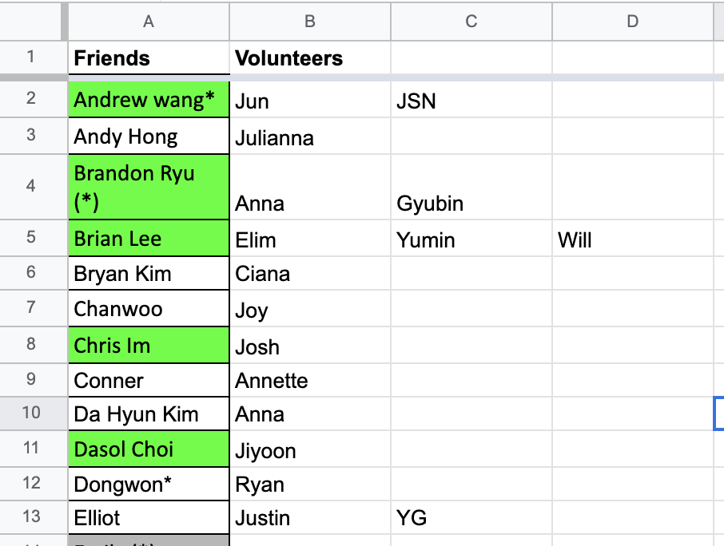

This is how we currently handle matching/pairing of volunteer with milal friend.

It's bad. Can be improved.

Requirements:

- Easy UI to do the matching and find who is matched with who for the day. Updating the excel is painful.
- Ability to track history of matching between volunteers and friends
- Track stats (i.e. who paired up with X last week, who paired up the most frequently with X, activity of friend/volunteer, etc.)

Good to haves:
- Make this a dynamic SPA with react. Easy, clean UI using [Ant CSS](https://ant.design/docs/react/introduce).
